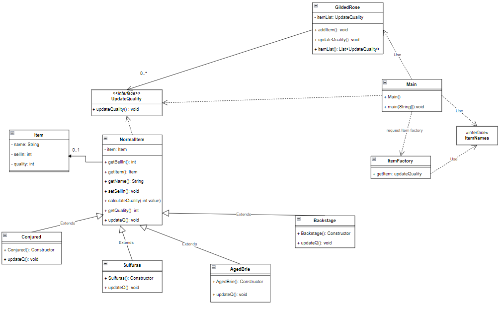

# gilded-rose

## Diagram Class (UML)

### IntelliJ IDEA

Open IntelliJ IDEA and select _File > Open..._.
Choose the java-maven-starter-project directory and click _OK_.
Select _File > Project Structure..._ and ensure that the Project SDK and language level are set to use Java 11.
Open the Maven view with _View > Tool Windows > Maven_.
In the Maven view, under _Plugins > dependency_, double-click the `dependency:unpack` goal. This will unpack the native libraries into $USER_HOME/.arcgis.
In the Maven view, run the `compile` phase under _Lifecycle_ and then the `exec:java` goal to run the app.

### Eclipse

Open Eclipse and select _File > Import_.
In the import wizard, choose _Maven > Existing Maven Projects_, then click _Next_.
Select the java-maven-starter-project as the project root directory.
Click _Finish_ to complete the import.
Select _Project > Properties_ . In _Java Build Path_, ensure that under the Libraries tab, _Modulepath_ is set to JRE System Library (JavaSE-11). In _Java Compiler_, ensure that the _Use compliance from execution environment 'JavaSE-11' on the 'Java Build Path'_ checkbox is selected.
Right-click the project in the Project Explorer or Package Explorer and choose _Run As > Maven Build..._. In the _Edit Configuration_ dialog, create a new configuration with name `unpack`. In the _Goals_ field, enter `dependency:unpack`. Click _Run_ to run the goal.
Again, create a new run configuration with name `run`. In the _Goals_ field, enter `compile exec:java`. Click _Run_ to run the goal. The app should compile and launch the JavaFX window.

### Command Line

`cd` into the project's root directory.
Run `./mvnw dependency:unpack` on Linux/Mac or `mvnw.cmd dependency:unpack` on Windows.
Run `./mvnw compile exec:java` on Linux/Mac or `mvnw.cmd compile exec:java` on Windows to run the app.

### Requirements

See the Runtime SDK's system requirements.

